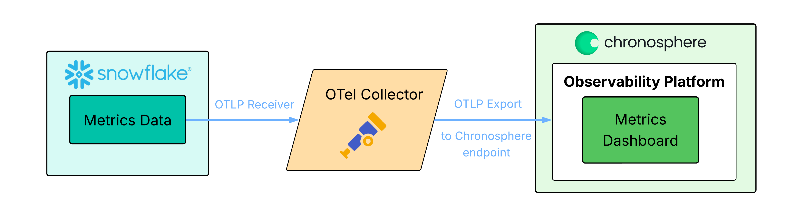
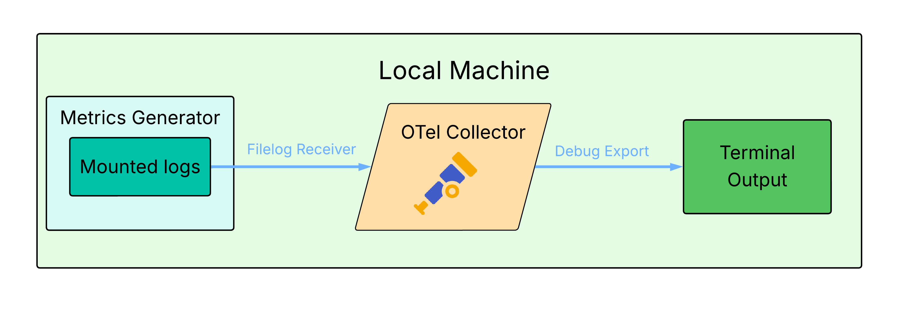
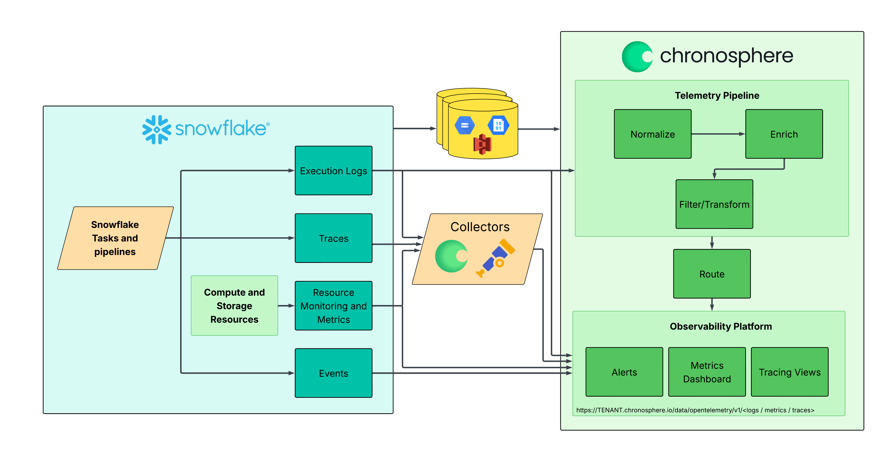

# Snowflake to Chronosphere Integration Demo
- [Snowflake to Chronosphere Integration Demo](#snowflake-to-chronosphere-integration-demo)
  - [Overview](#overview)
  - [Potential Target vs Simulated Approach](#potential-target-vs-simulated-approach)
    - [Components](#components)
    - [Target Production Model](#target-production-model)
    - [Simulated Demo Model](#simulated-demo-model)
  - [Architecture](#architecture)

## Overview
This demo simulates exporting metrics from Snowflake and sending them into the Chronosphere Observability Platform using OpenTelemetry Collector.

Since access to Snowflake and Chronosphere is unavailable, mock data is generated and logged to demonstrate data flow.

Steps:
1. Python script generates fake Snowflake metrics and writes to a log file
2. OTel Collector reads the log file, parses metric lines, and outputs structured logs
3. `debug` exporter shows what would be sent to Chronosphere as output in the command line

## Potential Target vs Simulated Approach
### Components

| Real Component       | Simulated Substitute                         |
|----------------------|----------------------------------------------|
| Snowflake            | Python script generating mock metrics        |
| OTel Collector       | OTel Collector (Docker)                      |
| Chronosphere         | Logging exporter (prints to console)         |

### 
Target Production Model

### 
Simulated Demo Model

## Architecture
There are many ways to integrate Snowflake with Chronosphere's Telemetry Pipeline and Observability Platform. This diagram shows some potential integration paths depending on a variety of use cases.

